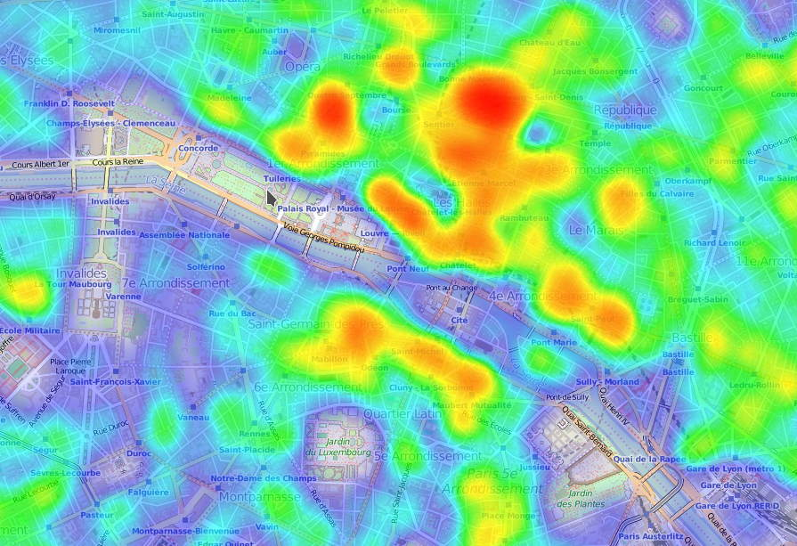

# OsmosisHeatmap
A plugin for [Osmosis](http://wiki.openstreetmap.org/wiki/Osmosis) generating a JavaScript files with the coordinates, useful for creating heatmaps (Osmosis is a tool for processing OpenStreetmap data in a configurable pipeline). Example of usage: display in a web page a heatmap of the items with 'addr:housenumber'.

The sources of the plugin itself is offered under the [GNU Lesser General Public License version 3](https://www.gnu.org/licenses/lgpl.html), or (at your option) any later version (like the [source-code of Osmosis](https://github.com/openstreetmap/osmosis) itself).

The directory "misc" contains a sample webpage displaying the generated data as a heatmap. Please note:

* That this page uses the tiles of the OpenStreetmap servers, which have a [usage policy](http://wiki.openstreetmap.org/wiki/Tile_usage_policy) you should read first. Basically, accessing it as an average individual is permitted (at the time of writing).

* The page uses the JavaScript libraries [Leaflet](http://leafletjs.com/) and [Leaflet.heat](https://github.com/Leaflet/Leaflet.heat) which are under their own licenses.

## Usage

### Installation

In your Osmosis installation, create a subdirectory "plugins" and copy "OsmosisHeatmap.jar" there. According to the source code, as an alternative you can also copy it either:

* in a subdirectory "plugins" of the current directory
* or in a directory ".openstreetmap/osmosis/plugins" of your user directory
* or in a directory openstreetmap/osmosis/plugins under your "AppData" directory (Windows)

### Execution

This plugin provides the task time "heatmapmerge" which takes as input a single input pipe. This task takes as parameter:

* (unnamed parameter) The type of action (required).
 * "node": Put in the output file the coordinates of all the nodes (the other elements are ignored).
 * "way": For each way, put in the output file the average coordinates of its nodes (the coordinates of the nodes themselves are not written).
* (named parameter) "output": the filename of the JavaScript to be generated (can contain a path).  

Sample bash script:

    OUTPUT=$PWD/heatmap_data.js
    
    cd /path/to/osmosis-latest
    
    ./bin/osmosis \
    --read-pbf file=/mnt/p2p/osm/some_dump.osm.pbf outPipe.0=1 \
    --bounding-box left=23.1548462 right=23.3690796 top=51.7740687 bottom=51.6271294 inPipe.0=1 outPipe.0=2 \
    --tee 2 inPipe.0=2 outPipe.0=3 outPipe.1=4 \
    --node-key keyList=addr:housenumber inPipe.0=3 outPipe.0=8 \
    --heatmapmerge node output="$OUTPUT" inPipe.0=8 \
    --tag-filter accept-ways addr:housenumber=* inPipe.0=4 outPipe.0=6 \
    --tag-filter reject-relations inPipe.0=6 outPipe.0=7 \
    --used-node inPipe.0=7 outPipe.0=9 \
    --tag-filter reject-relations inPipe.0=9 outPipe.0=10 \
    --heatmapmerge way output="$OUTPUT" inPipe.0=10

The script above will output the coordinates of the elements having a "addr:housenumber". It takes a dump file ('read-pbf'), only keeps a region of it ('bounding-box'), then splits it into two flows ('tee'):

* one that keeps only the nodes with "addr:housenumber" ('node-key'), then sends the remaining to a "heatmapmerge"
* anothes that removes the nodes without "addr:housenumber" (first 'tag-filter'), removes the relations (2nd 'tag-filter'), keep only the nodes belonging to a way ('used-node') and finally sends the nodes and ways to a "heatmapmerge".

Put "heatmap_data.js" in the folder "misc" and open "heatmap_test.html".

The folder "misc" contains "heatmap.sh", a configurable version of this bash script.

## Build instructions

This is a Maven project. Hopefully it will compile without any specific configuration.